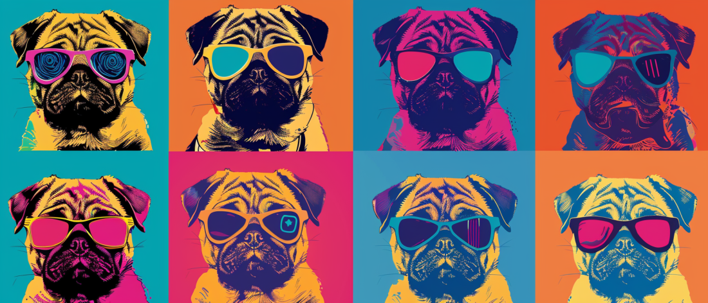

[](https://github.com/sebfried/pugsharp/)

# pugsharp

***It's not just [sharp](https://www.npmjs.com/package/sharp), it's pugsharp!***

Batch resize and reformat images for your [Pug](https://www.npmjs.com/package/pug) project, based on JSON configuration files.

## How it works
For every image listed in the `pugsharp.json` configuration file, pugsharp creates a dedicated directory named after the image. 

Inside the created directory, you'll discover the generated images, along with a `pugsharp.pug` file. This file is a powerful tool for seamlessly integrating the generated images into your project, making it incredibly easy to manage and display your images in a responsive and efficient manner.

The pugsharp module is designed to streamline your image handling process, saving you both time and effort, and making your project development smoother and more efficient.

## How to use it
If you have not already done so, [download and install Node.js and npm](https://docs.npmjs.com/downloading-and-installing-node-js-and-npm).

1. Navigate to your image directory.
2. Create a `pugsharp.json` configuration file.
3. Run `npx pugsharp` in the console.

Watch the magic happen.

## Configuration Files
Put a `pugsharp.json` configuration file in your image directory, right next to the images.

Each source image will have its own directory, based on the image name. That's where the generated images will be. 

### Minimal Configuration
Below is the minimal required configuration for an image in the `pugsharp.json` file.

```json
[
    {
        "img": "pug.png",
        "format": "jpeg",
        "from": 100,
        "to": 1200,
        "step": 300
    }
]
```

### Extended Configuration
```json
[
    {
        "img": "pug.png",
        "format": "jpeg",
        "from": 100,
        "to": 1200,
        "step": 300,
        "special": 10,
        "sharp-jpeg": {
            "mozjpeg": true,
            "quality": 80
        }
    },
    {
        "img": "pug2.avif",
        "format": ["avif","webp"],
        "from": 300,
        "to": 2000,
        "step": 100,
        "special": [1, 40],
        "lazy": false,
        "data-src": true,
        "sharp-avif": {
            "quality": 70,
            "effort": 7
        },
        "sharp-webp": {
            "quality": 80,
            "effort": 5
        }
    }
]
```
### Configuration Keys
`"img"`: File name of the image.  
`"format"`: Target image format(s).  
`"from"`: Smallest target image size.  
`"to"`: Largest target image size.  
`"step"`: Pixel step size between small and large.  
`"special"`: Additional special image size(s).  
`"lazy"`: If false, *`loading="lazy"`* won't be applied to the img element. Default is `true`.  
`"data-src"`: If true, you'll get *``*, instead of *``*. Same for *`<source srcset>`*.   
`"sharp-*"`: For detailed format options, see the [sharp format documentation](https://sharp.pixelplumbing.com/api-output#toformat).

## Pug Mixins
Pugsharp generates a Pug mixin template for each processed image, further simplifying the integration of responsive images into your Pug projects.

### How to use the Pug Mixins
Within the directory of any processed image, you'll find a complementary `pugsharp.pug` file that contains a ready-to-use mixin. This mixin enables easy integration of the generated images. 

Simply include the `pugsharp.pug` file and call the mixin, providing the image path, alt text and optionally, additional attributes. 

### Basic Pug Mixin
Include the mixin and call it with the image's file path, alternative text and the [sizes](https://developer.mozilla.org/en-US/docs/Web/API/HTMLImageElement/sizes) property for the `source` tags:  

`+img('img source path', 'alt text, {sizes})`

Example:
```
include pug/pugsharp.pug
+img('pug/pug-100.jpg', 'pug image', {sizes:'3vw'})
```

### Basic HTML Output
Here's how the Pug mixin translates into sample HTML output:
```html
<picture>
    <source srcset="pug/pug-100.avif 100w, pug/pug-200.avif 200w" type="image/avif" sizes="3vw">
    <source srcset="pug/pug-100.jpg 100w, pug/pug-200.jpg 200w" type="image/jpg" sizes="3vw">
    
</picture>
```

### Extended Pug Mixin, with Attributes
Include the mixin and call it with additional attributes:  
`+img('img source path', 'alt text', {attributes})`

It is possible to define any valid HTML attribute for the `` tag in the mixin, in a JavaScript object:  
```
include img2/pugsharp.pug
+img('img2/img2-200.jpg', 'pug image', {sizes:'4vw', class:'paw', decoding:'sync'})
```

Only the `sizes` property will be added to `source` tags. All other attributes will be applied to the `img` element.

### Extended HTML Output
Sample HTML output with additional attributes on the `img` element and `sizes` on the `source` elements:
```html
<picture>
    <source srcset="img2/img2-100.avif 100w, img2/img2-200.avif 200w" type="image/avif" sizes="4vw">
    <source srcset="img2/img2-100.jpg 100w, img2/img2-200.jpg 200w" type="image/jpg" sizes="4vw">
    
</picture>
```

See the [Mozilla Developer Network (MDN)](https://developer.mozilla.org/en-US/docs/Web/HTML/Element/img) documentation for more details on image attributes.

## Additional Information
* The pugsharp module is designed not to overwrite existing directories or images.
* Only the `pugsharp.pug` files for specified images will be overwritten when you run pugsharp.
* If you wish to regenerate images or directories, you must delete them manually beforehand.
* Image directories will be created right next to the `pugsharp.json` configuration file.
* It is recommended to place the configuration file in the same directory as the source images. 
* If you find a pug, feel free to report it.  

## How to support this Project
Your support, whether through code, feedback, or donations on Ko-Fi, is invaluable to keeping this project thriving!

**On GitHub, your contributions can help in various ways:**

* Submit a Pull Request: Enhance features, fix bugs, or improve documentation.
* Report Issues: Found a bug or have a feature request? Let us know!
* Spread the Word: Star the repository and share it with your network!

**On Ko-Fi, your donations support:**

* Continued development and maintenance of pugsharp.
* New features and updates.
* The coffee that fuels late-night coding sessions!

Every bit of support motivates and helps maintain the project's quality and accessibility. 

[Support on Ko-Fi](https://ko-fi.com/pugsharp) | [Contribute on GitHub](https://github.com/sebfried/pugsharp/)

Thank you for your generosity and belief in this project! Let's pug it!

[](https://ko-fi.com/pugsharp)